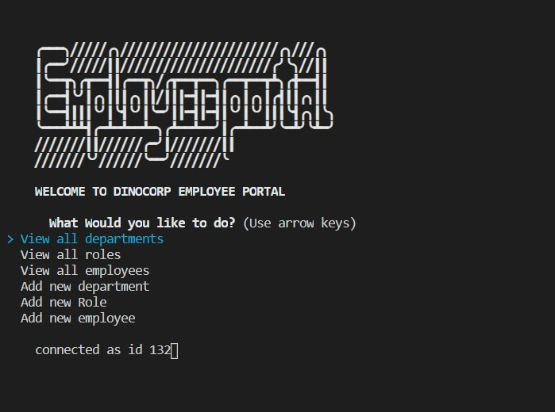
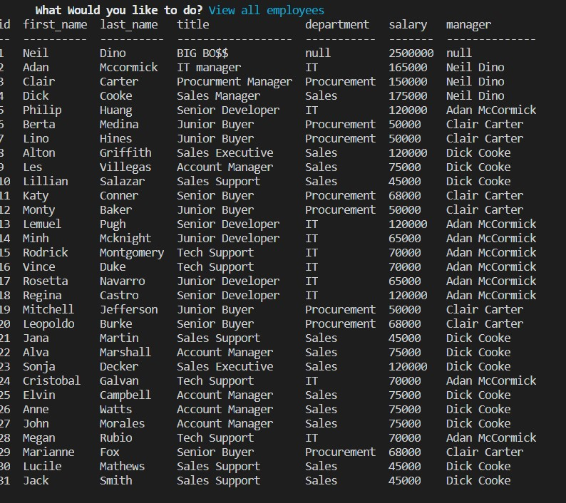
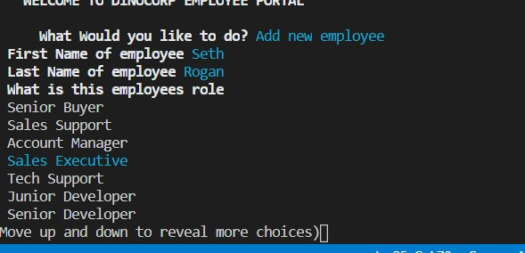

# Dinocorp Employee Tracker

## Overview
This CLI application manages a database of employees.  From the main menu you can view the different departments, roles and employees.  There is also an option to add a new department, role and Employee.

## Installation and Set UP

Must have Node JS and MySQL to use this application. Open a terminal in the root folder and hit npm install.  This will install inquirer, sql2 and Console Table.  Copy and paste both the Schema and the Seeds files (or open them) into MySQL workbench.  Run the workbench to populate the database

## Usage

Open a terminal in the root directory and enter 'npm start'.  Use the up and down arrows to navigate to the action you would like to preform.  Press enter to select the desired action.  For any "View" selection you will see a table with the information you selected.  If you select an "add" action you will see a prompt to enter the necessary information to run an add query in mysql.  Once you have finished the prompt a table including the new entry will be called and displayed in the terminal.

## Examples

The following Image shows an example of what you will see on the main menu of the application:

The following image is an example of a table of data that is returned on a view action:

The following image is an example of a a prompt to add a new employee:

## More Information

Since this is a CLI application it is not deployed.  Check out my rundown of the application on youtube:

[Youtube Video](https://www.youtube.com/watch?v=5MvhXAjnVQw&feature=youtu.be)